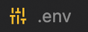
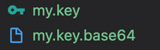
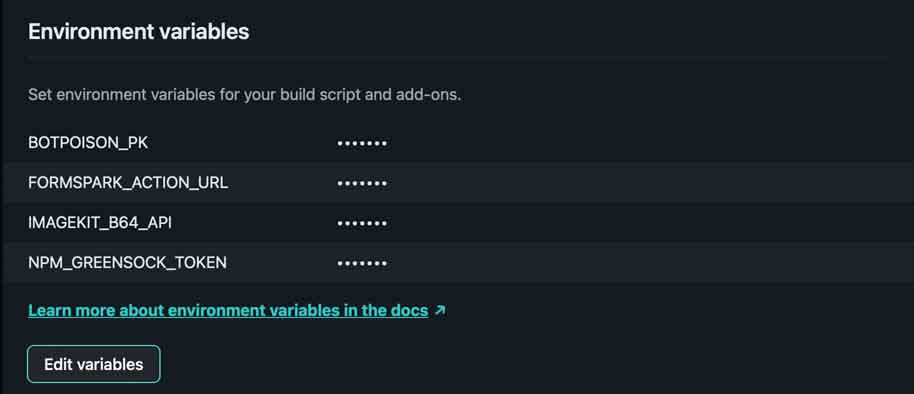

# [Benjamin Oddou Photographe](https://www.benjaminoddou-photographe.com)

[](https://app.netlify.com/sites/benjaminoddou-photographe/deploys)
[](https://github.com/BenjaminOddou)
[](https://saythanks.io/to/BenjaminOddou)
[](CODE_OF_CONDUCT.md)

Welcome to the repository of my personal website dedicated to **Photography** 📸

## 🦾 Main Technologies

### Design

1.  [Figma](https://www.figma.com)
2.  [Adobe Photoshop](https://www.adobe.com/fr/products/photoshop.html)

### Front-End

1.  [Nuxt 3](https://v3.nuxtjs.org)
2.  [Tailwind CSS](https://tailwindcss.com)
3.  [GSAP](https://greensock.com/gsap/) with Premium [Shockingly Green](https://greensock.com/club/) Plugins
4.  [ImageKit CDN](https://imagekit.io)
5.  [Photoswipe](https://photoswipe.com)
6.  [Vue Masonry Wall](https://vue-masonry-wall.yeger.eu)

### Back-End

1.  [Formspark](https://formspark.io)
2.  [Botpoison](https://botpoison.com)

### IDE and Production

1.  [Visual Studio Code](https://code.visualstudio.com)
2.  [GitHub](https://github.com)
3.  [Netlify](https://www.netlify.com)

## ✨ Code Usage and Contribution

### Code Usage

The project is open source so you can use part of the code but <u>**not entirely**</u>. Also, <u>**don't use the style**</u> (CSS and assets) as it is personnal and makes this website unique.

This code is under [MIT Licence](LICENSE) ⚖️

### Contribute

To contribute to the project, you can read the [Contributing document](CONTRIBUTING.md) and the [Code of Conduct](CODE_OF_CONDUCT.md) 🔍

## 👨‍💻 Environment (for OSX or Linux)

### NVM

Install [nvm](https://github.com/nvm-sh/nvm). Open the `terminal` and run one of the following :

```sh
curl -o- https://raw.githubusercontent.com/nvm-sh/nvm/v0.39.1/install.sh
```

```sh
wget -qO- https://raw.githubusercontent.com/nvm-sh/nvm/v0.39.1/install.sh
```

To verify that [nvm](https://github.com/nvm-sh/nvm) has been installed, do:

```sh
command -v nvm
```

### Node.js and npm

Install [node.js](https://nodejs.org/en/) using [nvm](https://github.com/nvm-sh/nvm) by running :

```sh
# the last stable version like 16.17.0
nvm install
```

To display a list of [node.js](https://nodejs.org/en/) versions that are installed on your machine, enter:

```sh
nvm ls
```

Switch versions by passing the version the same way you do when installing:

```sh
# version like 18.12.1
nvm use
```

Check the [node.js](https://nodejs.org/en/) and [npm](https://docs.npmjs.com/cli/v8/configuring-npm/install) versions by running :

```sh
node -v
npm -v
```

To get the latest LTS version of node and migrate your existing installed packages, use :

```sh
nvm install 'lts/*' --reinstall-packages-from=current
```

To get the the latest version of npm, use one of the following command :

```sh
nvm install-latest-npm
npm install -g npm@latest
```

### VSCode

1. Install [Visual Studio Code](https://code.visualstudio.com)
2. Install the following extensions :
   -  [Better TOML](https://marketplace.visualstudio.com/items?itemName=bungcip.better-toml)
   -  [ESLint](https://marketplace.visualstudio.com/items?itemName=dbaeumer.vscode-eslint)
   -  [HTML CSS Support](https://marketplace.visualstudio.com/items?itemName=ecmel.vscode-html-css)
   -  [Import Cost](https://marketplace.visualstudio.com/items?itemName=wix.vscode-import-cost)
   -  [JavaScript (ES6) code snippets](https://marketplace.visualstudio.com/items?itemName=xabikos.JavaScriptSnippets)
   -  [Material Icon Theme](https://marketplace.visualstudio.com/items?itemName=PKief.material-icon-theme)
   -  [npm Intellisense](https://marketplace.visualstudio.com/items?itemName=christian-kohler.npm-intellisense)
   -  [Path Intellisense](https://marketplace.visualstudio.com/items?itemName=christian-kohler.path-intellisense)
   -  [PostCSS Language Support](https://marketplace.visualstudio.com/items?itemName=csstools.postcss)
   -  [Tailwind CSS IntelliSense](https://marketplace.visualstudio.com/items?itemName=bradlc.vscode-tailwindcss)
   -  [Vue Language Features (Volar)](https://marketplace.visualstudio.com/items?itemName=Vue.volar)

## 🛠️ Setup

### Command-line interface (CLI)

> Always reinstall CLI packages after changing the node version

####  Dotenv CLI

Install the [dotenv cli](https://www.npmjs.com/package/dotenv-cli) globally by running :

```sh
npm install -g dotenv-cli
```

Use `env variables` (e.g. API keys) by creating a `.env` file at the root of the project



####  Quicktype CLI

Install the [quicktype cli](https://github.com/quicktype/quicktype) globally by running :

```sh
npm install -g quicktype
```

Use `quicktype` to generate a strongly typed API response :

```sh
quicktype --src tmp/imgkit.json --top-level ImageKit --just-types --nice-property-names --acronym-style pascal --lang ts -o tmp/tmp.ts
```

> To run after generating the proper `.json` file

For  ImageKit :

1. Use the [cURL](#using-curl) command to download a sample response under `tmp` folder.
2. Run `quicktype` command to generate a `tmp.ts` file and copy it under the global declartion of `./types/imgkit.d.ts`

```ts
// ./types/imgkit.d.ts
export {}
declare global {
  // Copy Code Here
}
```

### Packages

Copy the current repo locally and install all `node_modules` via the following command :

```sh
dotenv npm install
```

### GitHub Hooks

Install [Husky](https://typicode.github.io/husky/#/) to perform actions when commiting or pushing code to  [GitHub](https://github.com) :

```sh
# Create .husky folder
npx husky-init
```

## 📜 Scripts

### Nuxt API commands (see [Documentation](https://v3.nuxtjs.org/api/commands/dev))

#### Run development server

```sh
# it will run "npx nuxi dev"
npm run dev
```

#### Build / Generate the app

Build the app without prerendering pages

```sh
# it will run "npx nuxi build"
npm run build
```

Build the app and prerender all `.vue` files into `.html` static files

```sh
# it will run "npx nuxi generate"
npm run generate
```

#### Preview the app

Preview the built / generated app

```sh
# it will run "npx nuxi preview"
npm run preview
```

#### Upgrade nuxt version

Using directly `npx`

```sh
# please don't use `-f` | `--force` parameter
npx nuxi upgrade
```

> Remove manually `node_modules` and `package-lock.json` after upgrade and run `dotenv install`

### Update npm packages

1. Using npm command

```sh
dotenv npm update
```

> Note that by default `npm update` will not update the semver values of direct dependencies in the project `package.json`

2. Using [npm-check-updates](https://www.npmjs.com/package/npm-check-updates) to force package.json to update to latest version (recommended)

```sh
# it will run "npx --yes npm-check-updates -u"
dotenv npm run upck
```

> Run `dotenv npm install` instead of the proposed `npm install` in order to use `.env` variables

### Format the code

Run globally [ESLint](https://eslint.org) on the project to format the code.

```sh
# it will run "eslint . --fix"
npm run eslint-fix
```

### Push a release on GitHub

#### Semantic versioning

Semantic Versioning ([SemVer](https://semver.org)) is a de facto standard for code versioning. It specifies that a version number always contains these three parts :

1. **MAJOR** version is incremented when you add breaking changes, e.g. an incompatible API change
2. **MINOR** version when you add functionality in a backwards compatible manner
3. **PATCH** version when you make backwards compatible bug fixes

#### First Release

To generate the changelog for the first release, run:

```sh
# npm run script
npm run release -- --first-release
```

#### GitHub Hooks

```sh
# Enable Git Hooks
npm run prepare
# it will run "standard-version -a"
npm run release
# it will run "standard-version -a --release-as patch"
npm run release:patch
# it will run "standard-version -a --release-as minor"
npm run release:minor
# it will run "standard-version -a --release-as major"
npm run release:major
```

> See [GitHub repo](https://github.com/conventional-changelog/standard-version) of Standard Version

### Create a performance report

Run [Unlighthouse](https://unlighthouse.dev) to scan an entire website (to define in `package.json` file) with  [Google Lighthouse️](https://developer.chrome.com/docs/lighthouse/overview/)

```sh
# it will run "npx unlighthouse --site https://www.benjaminoddou-photographe.com"
npm run lighthouse
```

### Print the structure of the project

1. Install [tree](http://mama.indstate.edu/users/ice/tree/) via [HomeBrew](https://brew.sh)
2. Run the following command to display a tree

```sh
# using -a to list all files, L <level> to define the depth of the tree and -I <pattern> to ignore patterns
tree -a -L 1 --charset utf-8
```

check the Documentation by running :

```sh
tree --help
```

### Encoding API key to Base64

> Used for  ImageKit API

1. Create a file named `my.key` with a `private API key` at the root of the project
2. Launch the following script to encode the API key

```sh
openssl enc -base64 -in my.key -out my.key.base64
```

The output looks like this:



### Fetch Data from  ImageKit API

#### Using cURL

```sh
curl -X GET "https://api.imagekit.io/v1/files?<query>" \-u <private_API_key>: | json_pp > tmp/imgkit.json

curl "https://api.imagekit.io/v1/files?<query>" \-H 'Authorization: Basic <Base64_private_API_key>' | json_pp > tmp/imgkit.json
```

> json_pp is used to format JSON. 🚨 Output directory must exists (tmp folder here)

The two command lines output the same result. To see the different options for the `<query>`, check the documentation that can be found [here](https://docs.imagekit.io/api-reference/api-introduction)

#### Using API endpoint and $fetch / useFetch() composable from  Nuxt 3

```ts
// In nuxt.config.ts
export default defineNuxtConfig({
  runtimeConfig: {
    IMAGEKIT_B64_API: process.env.IMAGEKIT_B64_API, // Defined in .env file
    public: {
      // public keys here
    }
  },
})

// In server/api/imgkit.ts
export default defineEventHandler(async () => {
  const config = useRuntimeConfig()
  const response = await $fetch('https://api.imagekit.io/v1/files', {
    method: 'GET',
    headers: {
      Authorization: 'Basic ' + config.IMAGEKIT_B64_API
    }
  })
  return response
})

// In pages/components
<script setup>
const { data: images } = useFetch<ImageKit[]>('/api/imgkit')
</script>
```

## 🏗️ Structure

> Generated with [tree](http://mama.indstate.edu/users/ice/tree/)

```sh
.
├── .commitlintrc.json # Commitlint configuration file
├── .env # Environment variables (not in GitHub repo - private 🤐)
├── .eslintrc.json # ESLint config file
├── .git # All git info
├── .github # Assets for GitHub repo
├── .netlify # netlify edge / internal functions (not in GitHub repo ❌)
├── .gitignore # List of files that should be ignore by Git
├── .husky # husky config folder (GitHub hooks)
│   ├── _ # generated by husky init command
│   │   ├── .gitignore
│   │   └── husky.sh
│   └── commit-msg # Commitlint with Github hooks
├── .npmrc # Npm config file with GSAP connexion to private repository
├── .nuxt # Nuxt uses the .nuxt/ directory in development to generate Vue application (not in GitHub repo ❌)
├── .output # Nuxt creates the .output/ directory when building the application for production. (not in GitHub repo ❌)
├── .versionrc.json # Changelog format configuration file
├── .vscode
│   └── settings.json # VSCode local settings
├── README.md # This document 👋
├── app.vue # entry point and general backbone of the app. This is the main component in Nuxt 3 applications
├── assets # The assets/ directory is used to add all the website's assets that the build tool (Vite) will process.
│   ├── css
│   │   └── tailwind.css # Tailwind directives
│   ├── pwa-512x512.png # PWA Icon
│   ├── svgs # svgs used in the website
│   │   ├── arrow-button.svg
│   │   ├── big-circle.svg
│   │   └── ...svg
├── components # The components/ directory is where all Vue components can be imported inside pages or other components
│   ├── FAQquestion.vue
│   ├── TheAlert.vue
│   ├── TheAwwwards.vue
│   ├── TheCursor.vue
│   ├── TheFooter.vue
│   ├── TheForm.vue
│   ├── TheHeader.vue
│   ├── TheMenu.vue
│   ├── TheMenuLink.vue
│   ├── ThePreloader.vue
│   ├── TheTransition.vue
│   └── TheSVG.vue
├── utils # Auto imported functions
│   ├── piniaStore.ts # State Management store functions
│   └── index.ts # Helper functions
├── dist # folder with built website (not in GitHub repo ❌)
├── node_modules # All modules installed by npm (not in GitHub repo ❌)
├── CHANGELOG.md # File that tracks all changes
├── CODE_OF_CONDUCT.md # Code of conduct
├── CONTRIBUTING.md # Contributing guide
├── LICENSE # MIT License
├── netlify.toml # Configuration file for netlify
├── nuxt.config.ts # Nuxt configuration file
├── package-lock.json # Aggregates an immutable version of the package.json file
├── package.json # Contains all the dependencies and scripts of the application
├── pages # All pages belongs here. Nuxt provides a file-based routing to create routes within the app using Vue Router under the hood.
│   ├── [...slug].vue # catch all route (404 not founf)
│   ├── about.vue # About page
│   ├── gallery.vue # Gallery page
│   └── index.vue # Home page
├── plugins # All Nuxt and Vue plugins
│   └── vue-masonry-wall.ts # Vue masonry plugin
├── public # files that shouldn't be processed by build tool (Vite)
│   ├── _redirects # redirects rules for Netlify
│   ├── banner.jpg
│   ├── browserconfig.xml
│   ├── favicon.ico
│   ├── me.jpg
│   ├── mstile-150x150.png
│   ├── robots.txt
│   └── safari-pinned-tab.svg
├── server # Directory which register API and server handlers (Nitro routes) with HMR support
│   ├── api
│   │   └── imgkit.ts # ImageKit API endpoint (act as proxy)
│   ├── routes
│   │   └── sitemap.xml.ts # Sitemap generator
├── tmp # Temporary files to perform tests on API
│   ├── .gitkeep # empty hidden file to keep tmp folder in GitHub repo
│   ├── imgkit.json # Sample data from ImageKit cURL command (not in GitHub repo ❌)
│   └── tmp.ts # Output typescript API generated with quicktype command (not in GitHub repo ❌)
├── types # Typescript declaration
│   └── imgkit.d.ts # Declaration file for ImageKit API
├── tailwind.config.js # Tailwind config file
└── tsconfig.json # File that references .nuxt/tsconfig.json which resolved aliases used in a Nuxt project
```

## 🚀 Deploy

The hosting of the website is made available by connecting this  [GitHub](https://github.com) repository to  [Netlify](https://www.netlify.com).

When deploying, the `command script` and `environment variable(s)` needs to be defined under `Build & deploy | Site settings` on  [Netlify](https://www.netlify.com).

Command scripts :

```sh
# Classic SSR build
npm run build
# Prerendering routes to optimize SEO and response time
npm run generate
```

> ⚗️ [Nitro](https://nitro.unjs.io/deploy/providers/netlify) used by  [Nuxt 3](https://v3.nuxtjs.org) will detect automatically  [Netlify](https://www.netlify.com) hosting and deploy with preset='netlify'

Environment variable(s) :



## ⚖️ License

[MIT License](LICENSE) © Benjamin Oddou
